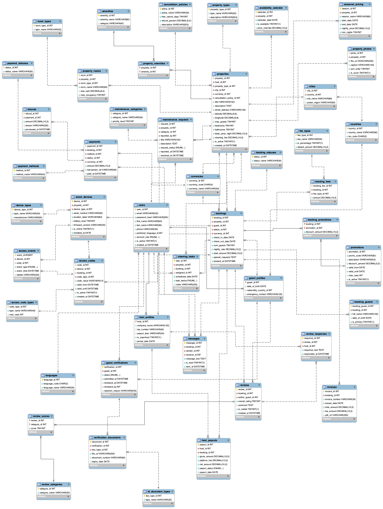

# Short-Term Rental & Smart Access Management System

A full-stack web application built on a relational MySQL database, covering the complete lifecycle of a short-term rental platform — property listings, bookings, guest identity verification, smart lock access codes, reviews, and financial reporting. Designed and implemented as a Database Design course project at Modul University Vienna.

---

## Overview

Short-term rental hosts typically manage several disconnected systems: a listing platform, spreadsheets for identity checks, a separate smart-lock app, and chat threads for cleaners. This fragmentation creates real problems — door codes get reused across stays, identity verification is skipped under time pressure, and there is no single audit trail showing who entered a property and when.

This system consolidates the full rental lifecycle into one relational database with a Flask web application providing four distinct role-based dashboards.

---

## Web Application

A Flask web app built on top of the database, with separate dashboards for each user role:

### Guest
- Register a new account (passwords hashed with pbkdf2) or sign in
- Browse all properties on page load; filter by city, dates, and guest count with live availability overlap check
- Property cards show cover photos, amenities, room counts, ratings, and pricing
- Two-step booking flow: choose dates → select payment method → confirmation page
- View booking history with status and payment badges
- Retrieve door access codes (auto-generated when host confirms)
- Submit reviews with an overall star rating and per-category scores (Cleanliness, Accuracy, Check-in, Communication, Location)
- View all past reviews and any host responses
- One-click "Become a Host" to switch role and list properties

### Host
- Dashboard with revenue, active bookings, and upcoming check-in counts
- My Properties: card view with cover photo, amenities, booking and revenue stats per property
- Add Property: full listing form with property type, city, capacity, pricing, cancellation policy, amenity checkboxes, and up to 5 photo URLs
- Upcoming Check-ins: guest name, dates, verification and booking status
- Revenue summary from the `v_host_revenue` view
- Confirm Booking: select a pending booking and online device; a secure 6-digit access code is auto-generated and assigned
- Maintenance Requests: submit and track open requests by category
- Reviews: see all guest reviews across properties with category breakdowns; reply to individual reviews

### Admin
- System-wide stats: total users, active bookings, total revenue, unverified guest count
- Analytics: monthly revenue bar chart, booking status donut chart (Chart.js), top-performing properties, above-average spending guests
- User management: list all accounts, activate/deactivate with one click
- Bookings: filterable table across all bookings
- Access Audit: full log of smart lock events from the `v_access_audit` view
- Guest Verification: approve or reject pending identity verification submissions with a reason modal; view unverified upcoming check-ins with urgency badges

### Cleaner (Staff)
- Task cards showing full notes, booking dates, and current status
- Mark tasks as done
- Upcoming check-ins for assigned properties
- View assigned access codes

---

## Database Design

- **46 tables** — 29 transactional, 17 reference
- **Full 3NF normalisation** — reference tables eliminate update anomalies; one deliberate denormalisation in `bookings` preserves the agreed price at booking time
- **4 user roles** — host, guest, staff/cleaner, admin — each with minimum necessary privileges
- **8 reporting views** — property catalog, upcoming check-ins, host revenue, access audit log, unverified guest compliance, property performance, guest booking history, host revenue summary
- **4 composite indexes** — targeting the most frequent query patterns including availability search by property and date range
- **4 stored procedures** — booking creation, booking confirmation with access code generation, cancellation with refund, stay completion with host payout

### Key Design Decisions

- Monetary values use `DECIMAL` not `FLOAT` to avoid floating-point rounding in financial records
- `access_events` uses `BIGINT` primary key as the table grows with every lock interaction
- Users modeled as a supertype with `host_profiles` and `guest_profiles` as 1:1 subtypes sharing the user primary key, avoiding a wide table full of nulls
- Booking overlap enforced at the application layer using the interval condition since MySQL has no declarative temporal non-overlap constraint
- `reviews` has a unique constraint on `booking_id` — one review per completed stay; per-category scores stored separately in `review_scores`
- Access codes are auto-generated (6-digit random) when a host confirms a booking, then linked to a smart device via `sp_confirm_booking`

---

## File Structure

```
Rental-System-SQL/
├── 01_schema.sql                            # All 46 tables with constraints and foreign keys
├── 02_indexes_views_roles_transactions.sql  # Indexes, views, MySQL roles, stored procedures
├── 03_sample_data.sql                       # Coherent sample data across all 46 tables
├── 04_test_calls.sql                        # Stored procedure test calls
├── ER_Diagram.png                           # Entity-Relationship diagram
├── app.py                                   # Legacy Python console application
└── flask_app/
    ├── app.py                               # Flask entry point, login, register, become-host
    ├── config.py                            # Database connection config
    ├── db.py                                # Query helpers using Flask g
    ├── requirements.txt                     # Python dependencies
    ├── routes/
    │   ├── admin.py                         # Admin blueprint
    │   ├── auth.py                          # login_required decorator
    │   ├── cleaner.py                       # Cleaner/staff blueprint
    │   ├── guest.py                         # Guest blueprint
    │   └── host.py                          # Host blueprint
    └── templates/
        ├── base.html                        # Shared layout, CSS variables, badge system
        ├── login.html                       # Split-panel login page
        ├── register.html                    # Guest registration with password strength meter
        ├── become_host.html                 # Host onboarding page
        ├── admin/                           # Admin dashboard templates
        ├── host/                            # Host dashboard templates
        ├── guest/                           # Guest dashboard templates
        ├── cleaner/                         # Cleaner dashboard templates
        └── includes/                        # Shared sidebar partials per role
```

---

## Entity-Relationship Diagram



---

## Setup

```bash
# 1. Create the database and run the scripts in order
mysql -u root -p < 01_schema.sql
mysql -u root -p < 02_indexes_views_roles_transactions.sql
mysql -u root -p < 03_sample_data.sql

# 2. Install Python dependencies
cd flask_app
pip install -r requirements.txt

# 3. Configure your connection
# Edit flask_app/config.py with your MySQL host, user, and password

# 4. Run the Flask app
python app.py
# → Opens at http://localhost:5050
```

### Demo Accounts

| Role    | Email                        | Password  |
|---------|------------------------------|-----------|
| Admin   | admin@rentalaccess.com       | hash$9    |
| Host    | anna.gruber@example.com      | hash$1    |
| Guest   | tom.baker@example.com        | hash$4    |
| Cleaner | cleaner@rentalaccess.com     | hash$10   |

> Demo accounts use plaintext tokens for simplicity. New accounts registered through the UI use proper pbkdf2 password hashing.

---

## Tech Stack

| Layer      | Technology                        |
|------------|-----------------------------------|
| Database   | MySQL 8.0                         |
| Backend    | Python 3, Flask 3.0               |
| ORM        | Raw SQL via mysql-connector-python |
| Frontend   | Bootstrap 5, Bootstrap Icons      |
| Charts     | Chart.js 4.4                      |
| Auth       | Flask sessions, werkzeug hashing  |

---

## Key SQL Techniques Used

- Correlated `NOT EXISTS` subquery for date-overlap availability search
- Correlated subqueries per row in the upcoming check-ins view (verification status, active code count)
- Nested subquery inside `HAVING` for above-average guest spending report
- `DATE_FORMAT` + sort key trick for correct chronological month ordering in analytics
- Role-based access control with least-privilege principle (host IBAN hidden from public views)
- ACID transactions with explicit `ROLLBACK` on failure
- Temporal correctness — booking price preserved at time of creation, not recalculated
- `GROUP_CONCAT`-equivalent in Python layer for M:N amenity aggregation per property

---

## Authors

Bora Elshani, Dren Buqa  
B.Sc. Applied Data Science — Modul University Vienna  
Database Design and Management Course, 2025
